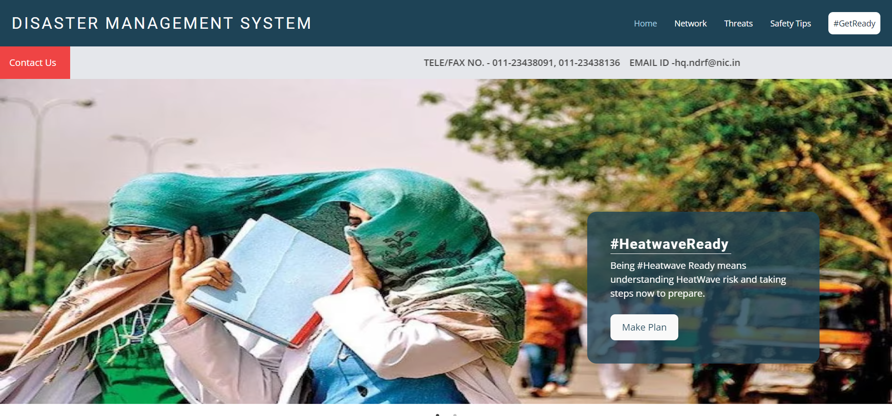
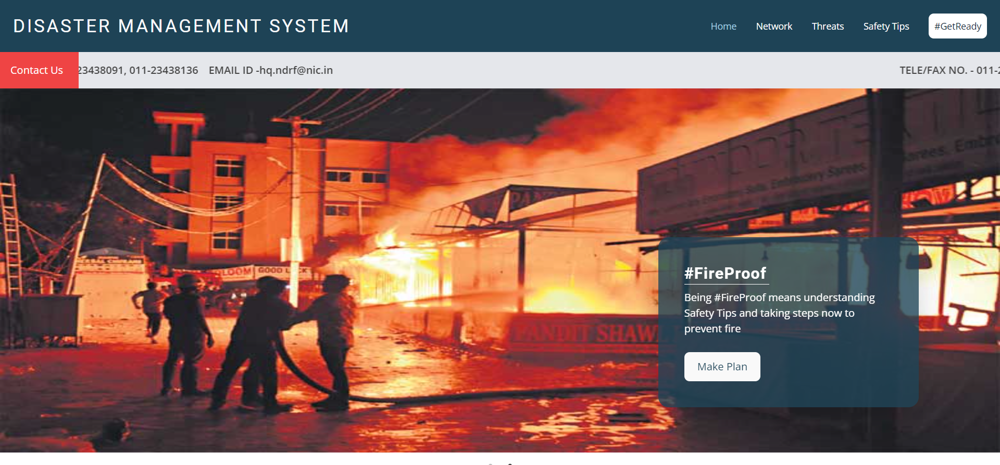
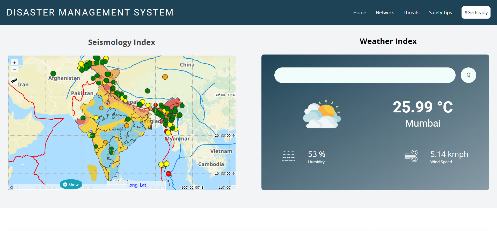
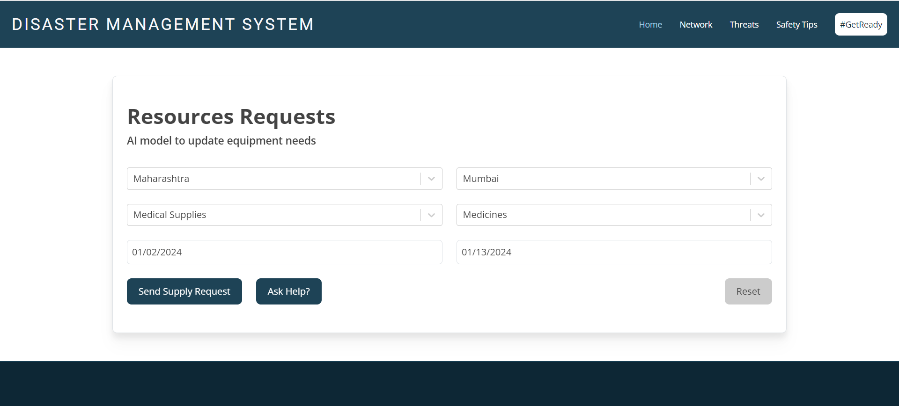
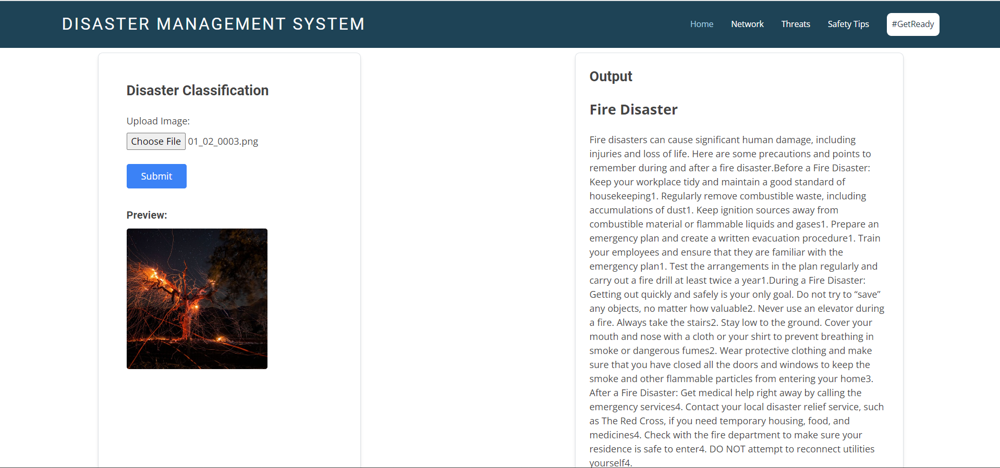
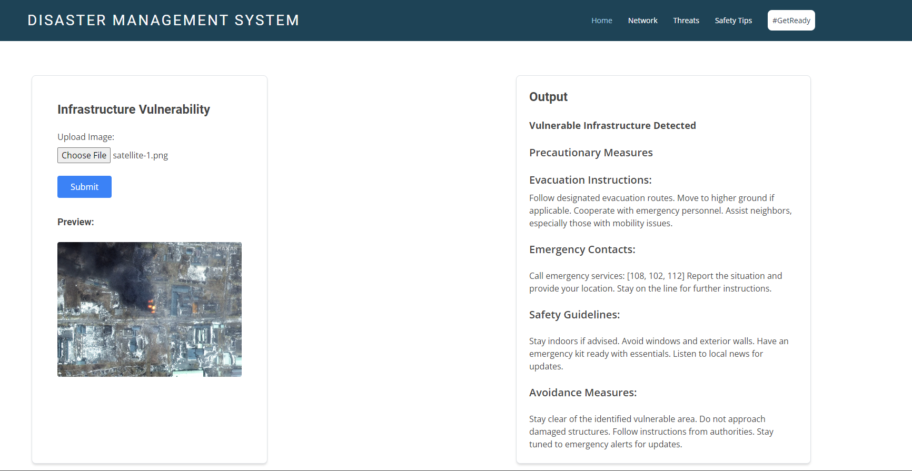
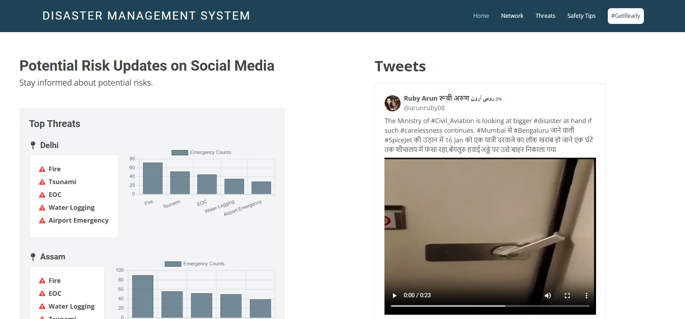
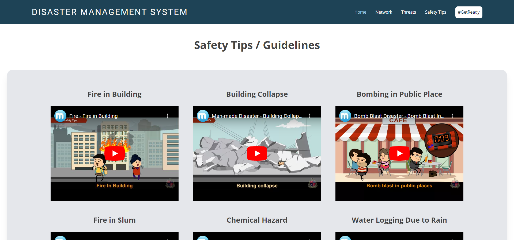
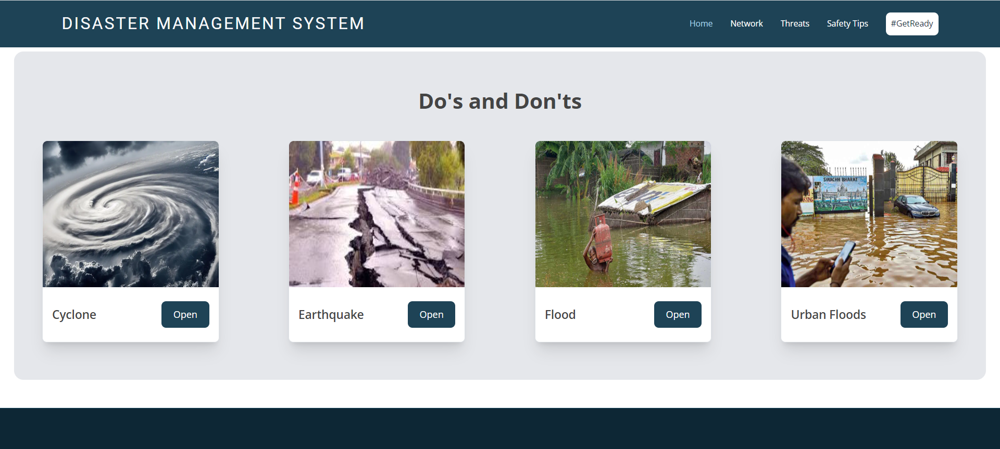

# Disaster Management System

## Project Title: AI-Powered Disaster Management

### Overview

The Disaster Management System is a comprehensive solution that integrates AI technologies to enhance disaster preparedness, response, and recovery efforts. Leveraging machine learning algorithms, natural language processing (NLP), and dynamic resource allocation, this system aims to revolutionize how we approach and manage catastrophic events.

### Key Features

1. **Real-time Disaster Prediction:**
   - Utilizes machine learning algorithms to analyze data from weather sensors, satellite imagery, and social media.
   - Provides timely alerts to authorities and communities, improving evacuation and preparedness.

2. **Dynamic Resource Allocation:**
   - AI algorithms optimize resource allocation based on historical and current data.
   - Ensures efficient deployment of emergency personnel, medical supplies, and equipment in response to evolving disaster scenarios.

3. **Critical Infrastructure Vulnerability Assessment:**
   - Machine learning models assess the vulnerability of critical infrastructure to various disasters.
   - Offers recommendations for retrofitting or reinforcing structures to enhance resilience.

4. **AI-Powered Decision Support System:**
   - Develops a decision support system powered by AI to assist emergency responders and authorities in making informed decisions during crises.
   - Provides real-time data analysis, scenario forecasting, and recommended courses of action.

5. **Real-time Social Media Analysis:**
   - Implements NLP algorithms to analyze social media and communication channels for real-time information about the disaster's impact on communities.
   - Facilitates better understanding of the ground situation for timely decision-making.

6. **Post-Disaster Data Analysis for Recovery Planning:**
   - Leverages AI to analyze post-disaster data, assess damage, and generate predictive models for recovery planning.
   - Supports decision-makers in developing effective long-term recovery strategies based on data-driven insights.

### Website Preview

